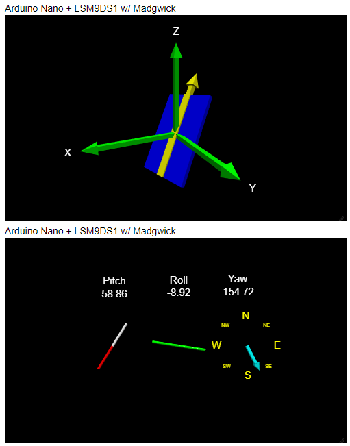

# Python-AHRS-Visualization
AHRS Visualization implemented in Python 3x.  Data is from Arduino Nano BLE Sense w/ LSM9DS1 via serial port.
We use the pitch, roll, and yaw values to create a visualization which updates on a loop.

